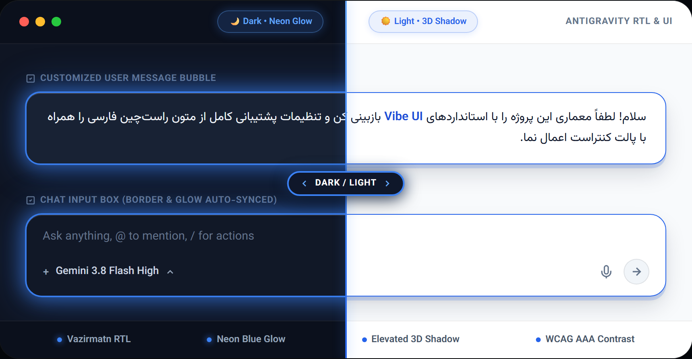
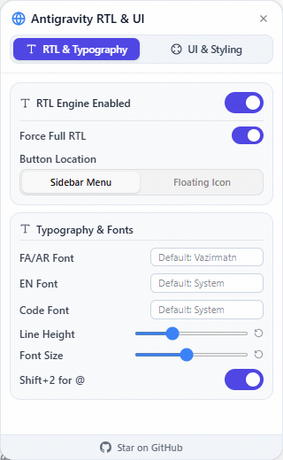
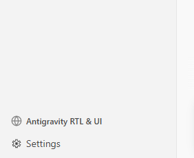

# Antigravity Smart RTL & UI Patcher

<p align="center">
  
</p>

<p align="center">
  <a href="#features">Features</a> •
  <a href="#installation">Installation</a> •
  <a href="#restoring-to-original-uninstall">Uninstall</a> •
  <a href="#how-it-works">How It Works</a> •
  <a href="#persian-guide-راهنمای-فارسی">راهنمای فارسی</a>
</p>

---

A smart and beautiful RTL (Right-to-Left) & UI Customization patch for the **[Antigravity](https://github.com/google/antigravity)** desktop application.

This CLI tool automatically injects a high-performance RTL engine and a modular Vibe UI Customization Panel into Antigravity. It delivers native-like support for Persian (Farsi), Arabic, Hebrew, and other RTL scripts, alongside granular controls for dual Dark/Light mode theme styling, typography, and sidebar responsiveness.

https://github.com/user-attachments/assets/f2e8722d-3aeb-47d3-a37e-c33b6a89676e

---

## ✨ Features

### 🎨 Dual-Theme UI & Styling Engine
- **Dedicated Dark & Light Tabs**: Independently customize user message bubbles for **Dark Mode** (with vibrant Neon Glow) and **Light Mode** (with elevated 3D shadow) to adapt effortlessly to any ambient lighting.
- **Anti AI-Slop & Zero Inversion Contrast**: Built upon WCAG AAA contrast standards; labels and text remain crystal clear with zero contrast inversion or invisible labels.
- **Granular Visual Controls**: Custom background color, text color, border width, border color, and shadow intensity presets (`None`, `Soft`, `Medium`, `Glow`).
- **Synchronized Chat Input Box**: Automatically aligns and styles the active chat input field border to match your personalized bubble aesthetics.
- **Decoupled from RTL Engine**: Custom UI styling stays completely active and independent, even if the RTL engine is switched off.

<p align="center">
  
</p>

### 📐 Ergonomic Sidebar & Compact Mode (140px)
- **Docked Above Settings**: Integrates seamlessly inside the main activity sidebar right above the Settings icon for an uncluttered workspace (switch back to floating badge anytime).
- **Fluid Mouse Resizing**: Eliminates rigid CSS overrides, restoring 100% natural, fluid mouse dragging between 140px and 600px.
- **Compact Sidebar (140px)**: Enables shrinking the sidebar down to 140px (breaking Antigravity's default 256px barrier) with left-pinned alignment to prevent text clipping.
- **Click-to-Toggle & Outside Dismiss**: Opens only on click and dismisses smoothly on outside clicks or the `Esc` key (no accidental hover triggers).

<p align="center">
  
</p>

### 📝 Smart Typography & RTL Engine
- **Intelligent Auto-Direction**: Dynamically inspects paragraph content and aligns Persian/Arabic to the right while keeping English and code snippets neatly LTR.
- **Force RTL Mode**: Option to align all text to the right when full RTL presentation is preferred.
- **Built-in Vazirmatn Variable Font**: Ships with the modern, elegant Vazirmatn font out of the box for superior readability.
- **Multi-Font Granularity**: Define different typography for RTL text, Latin text, and code blocks independently.
- **Typography Sliders**: Fine-tune line height and font size with real-time responsive sliders.
- **Persian Keyboard Optimization**: Automatically remaps `Shift + 2` to type `@` instead of `٬` on Persian keyboard layouts.
- **Zero White-Screen Startup Guard**: Wrapped inside an isolated IIFE with safe lifecycle hooks to prevent startup race conditions.

---

## 🚀 Installation

You don't need to clone any repositories or download files manually. Simply run the command for your operating system:

### macOS
Ensure [Node.js](https://nodejs.org) is installed (e.g. via Homebrew: `brew install node`). Run with `sudo` to allow patching application files:
```bash
sudo npx antigravity-rtl
```
> **macOS Users:** If you encounter a "Permission Denied" error even with `sudo`, ensure your terminal app (Terminal, iTerm2, VS Code) has **App Management** permission in `System Settings > Privacy & Security > App Management`.

### Linux
Run with `sudo` to allow patching application files:
```bash
sudo apt install nodejs npm # Skip if Node.js is already installed
sudo npx antigravity-rtl
```

### Windows
Open **PowerShell** as **Administrator** (Right-click -> Run as Administrator), then run:
```powershell
winget install OpenJS.NodeJS.LTS # Skip if Node.js is already installed
npx antigravity-rtl
```

> [!WARNING]
> **Antigravity Updates:** Because updating Antigravity overwrites internal application files, the patch will be reset upon each app update. Simply re-run `npx antigravity-rtl` to re-apply the patch.

---

## 🔄 Restoring to Original (Uninstall)

To revert Antigravity to its pristine factory state at any time, run the command with the `--restore` flag:

```bash
sudo npx antigravity-rtl --restore
```
*(On Windows, run without `sudo` in an Administrator PowerShell window)*

---

## 🛠️ How It Works

1. **Locates Installation**: Detects your Antigravity installation path across macOS, Linux, and Windows.
2. **Safe Backup**: Creates an untouched safety backup of the original `app.asar` file.
3. **Core Injection**: Unpacks the archive and injects the modular RTL & UI engine safely into client logic.
4. **Repacks & Seals**: Repackages the application so changes take effect immediately upon launch.

---

<div dir="rtl">

# Persian Guide (راهنمای فارسی)

## اصلاح‌کنندهٔ هوشمند راست‌به‌چپ و شخصی‌ساز ظاهر Antigravity

<p align="center">
  
</p>

یک افزونه و پچِ هوشمند، پایدار و مدرن برای پشتیبانی بی‌نقص از زبان‌های راست‌به‌چپ (RTL) و شخصی‌سازی پیشرفته رابط کاربری در نرم‌افزار **[Antigravity](https://github.com/google/antigravity)**.

این ابزار خط فرمان (CLI) بدون نیاز به کامپایل مجدد، موتور هوشمند RTL و پنل تنظیمات مدرن Vibe UI را به کلاینت Antigravity تزریق می‌کند و امکاناتی نظیر پشتیبانی کامل از زبان‌های فارسی، عربی و عبری، تم‌های مستقل تیره و روشن برای حباب پیام‌ها، سایدبار فشرده و تایپوگرافی را فراهم می‌سازد.

---

### 🌟 امکانات و قابلیت‌های کلیدی

#### ۱. استودیو شخصی‌سازی پیام‌ها (Dual Dark/Light UI)
- **دو تب کاملاً مستقل برای دارک‌مود و لایت‌مود**: تنظیم مجزای استایل پیام‌های کاربر در تم تیره (با افکت درخشش نئونی / Neon Glow) و تم روشن (با سایه برجسته سه‌بعدی / Elevated 3D Shadow) متناسب با نور محیط.
- **کنتراست استاندارد WCAG AAA**: تضمین خوانایی ۱۰۰٪ متون و لیبل‌ها در هر دو تم بدون هیچ‌گونه وارونگی ناخواسته یا محو شدن متن‌ها.
- **کنترل کامل المان‌های بصری**: شخصی‌سازی رنگ پس‌زمینه، رنگ متن، رنگ و ضخامت کادر (Border) و شدت سایه (`None`، `Soft`، `Medium`، `Glow`).
- **همگام‌سازی کادر ورودی چت**: هماهنگی خودکار استایل و بوردر کادر ورودی پیام‌ها (Chat Input Box) با حباب پیام کاربر.
- **استقلال کامل از موتور RTL**: استایل‌های ظاهری در تگ اختصاصی تفکیک شده و حتی در صورت خاموش کردن موتور RTL کاملاً فعال و دست‌نخورده باقی می‌مانند.

<p align="center">
  
</p>

#### ۲. یکپارچگی ارگونومیک با سایدبار و حالت فشرده (Compact 140px)
- **جای‌گیری شیک در سایدبار بالای Settings**: دکمه تنظیمات مستقیماً در سایدبار اصلی و در بالای آیکون Settings قرار می‌گیرد تا میز کار همیشه خلوت بماند (همراه با قابلیت بازگشت به آیکون شناور).
- **درگ کاملاً روان و طبیعی موس**: حذف محدودیت‌های صلب CSS و احیای کامل درگ آزاد موس بین ۱۴۰ تا ۶۰۰ پیکسل.
- **سایدبار فشرده (Compact 140px)**: امکان کوچک کردن سایدبار تا ۱۴۰ پیکسل (فراتر از محدودیت پیش‌فرض ۲۵۶ پیکسلی نرم‌افزار) همراه با تراز پین‌شده به چپ جهت رفع کامل باگ بریده شدن متون.
- **باز شدن با کلیک (Click-to-Toggle)**: حذف باز شدن‌های ناخواسته هنگام عبور موس؛ پنل صرفاً با کلیک باز شده و با کلیک بیرون یا کلید `Esc` بسته می‌شود.

<p align="center">
  
</p>

#### ۳. موتور هوشمند RTL و تایپوگرافی
- **راست‌چین خودکار پاراگراف‌ها (Smart Auto-Direction)**: تشخیص هوشمند زبان هر پاراگراف؛ متون فارسی راست‌چین و تکه‌های کد یا انگلیسی چپ‌چین و تراز باقی می‌مانند.
- **حالت راست‌چین اجباری (Force RTL)**: هدایت کلیه پیام‌ها به سمت راست تنها با فشردن یک کلید.
- **فونت وزیرمتن توکار**: گنجانده شدن فونت استاندارد و زیبای Vazirmatn Variable برای بالاترین سطح خوانایی.
- **تفکیک فونت‌ها**: امکان تعیین فونت اختصاصی و جداگانه برای متون فارسی، انگلیسی و بلاک‌های کد.
- **اسلایدرهای دقیق تایپوگرافی**: تنظیم فاصله خطوط (Line Height) و اندازه قلم (Font Size) پیام‌های چت به صورت زنده.
- **حل مشکل کیبورد فارسی**: نگاشت خودکار کلید ترکیبی `Shift + 2` برای تایپ کاراکتر `@` به جای «٬» در چیدمان فارسی.
- **محافظ ضد صفحه سفید استارت‌آپ**: اجرای ایزوله و امن در قالب IIFE با لودینگ منعطف در چرخه حیات کلاینت.

---

### 💻 آموزش نصب و استفاده

بدون نیاز به دانلود فایل یا کلون کردن مخزن، دستور متناسب با سیستم‌عامل خود را در ترمینال اجرا کنید:

#### در مک (macOS)
مطمئن شوید [Node.js](https://nodejs.org) روی سیستم نصب است (مثلاً با دستور `brew install node`). سپس دستور زیر را با `sudo` اجرا نمایید:
```bash
sudo npx antigravity-rtl
```
> **کاربران مک:** در صورت مواجهه با خطای عدم دسترسی حتی با وجود `sudo`، دسترسی **App Management** را در مسیر `System Settings > Privacy & Security > App Management` برای نرم‌افزار ترمینال خود فعال کنید.

#### در لینوکس
```bash
sudo apt install nodejs npm # در صورت نصب بودن نود جی‌اس این خط را رد کنید
sudo npx antigravity-rtl
```

#### در ویندوز
برنامه **PowerShell** را در حالت **Administrator** (راست‌کلیک -> Run as Administrator) باز کرده و دستور زیر را اجرا کنید:
```powershell
winget install OpenJS.NodeJS.LTS # در صورت نصب بودن نود جی‌اس این خط را رد کنید
npx antigravity-rtl
```

> [!WARNING]
> **به‌روزرسانی نرم‌افزار:** از آنجا که آپدیت‌های Antigravity فایل‌های داخلی برنامه را بازنویسی می‌کنند، پچ با هر بار آپدیت نرم‌افزار ریست می‌شود. پس از هر آپدیت کافیست دستور `npx antigravity-rtl` را مجدداً اجرا کنید.

---

### 🔄 بازگردانی به حالت اولیه کارخانه (Uninstall)

برای برگرداندن Antigravity به وضعیت دست‌نخورده قبل از پچ، از فلگ `--restore` استفاده کنید:

```bash
sudo npx antigravity-rtl --restore
```
*(در ویندوز دستور فوق را بدون `sudo` در ترمینال ادمین اجرا کنید)*

---

### 🤝 مشارکت در توسعه (Contributing)

با کمال میل از نظرات، پیشنهادات، گزارش باگ‌ها و ارسال Pull Request استقبال می‌شود.

</div>
